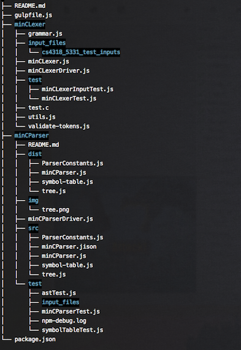

# minCParser built with JavaScript (Harmony)

## Notes
+ I opted to include "EOF" as a valid file (empty files are allowed)
+ Since it's built with ES6, there is a `build` process

## Directories/Files
+ minCParser/test/ is for unit tests
+ minCParser/src/ contains the actual file before it's transpied
+ minCParser/dist/ contains files that browsers (nowadays) can render

