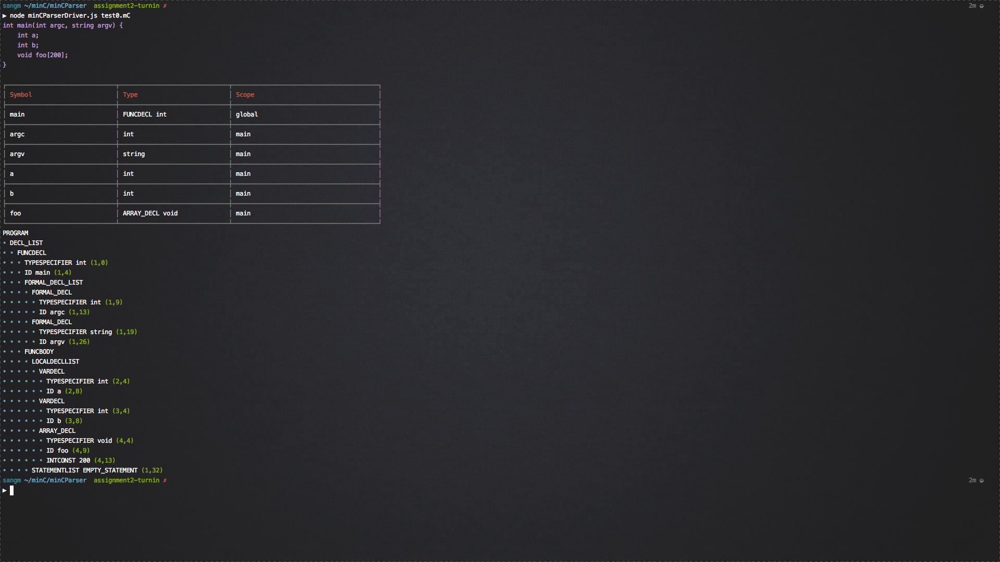

# minCParser built with JavaScript (Harmony)

## Notes
+ Need nodejs/npm
+ I opted to include "EOF" as a valid file (empty files are allowed)
+ Since it's built with ES6, there is a `build` process
+ Please try to use a UTF8 supported terminal if possible 

## Directories/Files
+ 
+ minCParser/test/ is for unit tests
+ minCParser/src/ contains the actual file before it's transpied
+ minCParser/dist/ contains files that browsers (nowadays) can render

## Usage
+ run `npm run init` in the project root directory
+ use `node minCParserDrive.js filename` to run a file
+ run `npm run parser` to convert all src(ES6) files to dist

## Examples
+ 

